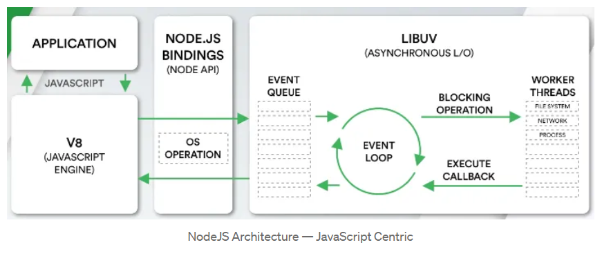

# Process in Node.js

PROCESS: A process in Node.js refers to an instance of the Node.js runtime that can be executed independently. Each Node.js process has its own memory space, global objects, modules, and event loop.

When you run a Node.js application, you’re essentially starting a process. Node.js applications can be single-threaded, meaning they run in a single process, or they can leverage the built-in clustering module to create multiple processes to take advantage of multi-core systems.

Create Multiple Processes: The Cluster module in Node.js is designed specifically to enable efficient load balancing of incoming network connections across multiple processes. It allows a Node.js application to take advantage of multi-core systems by creating multiple instances of the application, each running in its own process.

The primary purpose of the Cluster module is to distribute incoming connection requests (e.g., HTTP requests) across a pool of workers, allowing a Node.js server to handle multiple requests concurrently. This is achieved by forking the main Node.js process into multiple workers using a master/worker architecture.

# Thread :-

Node.js, by default, uses a single-threaded, event-driven architecture, meaning it utilizes a single thread (event loop) to execute JavaScript code. This single thread processes I/O operations (like file system and network operations) and asynchronous events.

However, Node.js does use additional threads from a thread pool managed by the libuv library to handle certain operations, such as file system operations.

It is also possible to create multiple threads by utilizing Worker Threads, a module provided by Node.js for handling heavy CPU-bound computation and parallel processing.

#Nodejs Architecture

